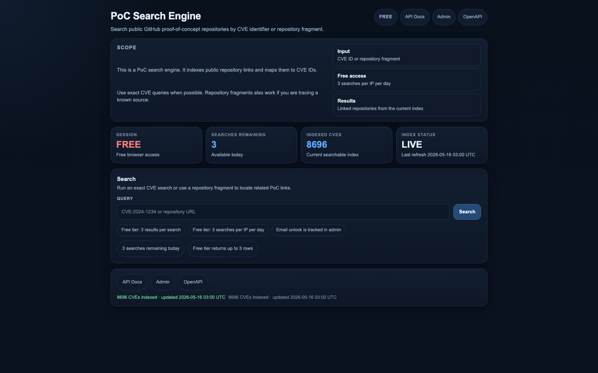

# PoC CVEs — Proof-of-Concept Repository Index

> A continuously updated index of public GitHub proof-of-concept repositories mapped to CVE identifiers. Strictly for educational and defensive security research purposes.

[](https://labs.jamessawyer.co.uk/cves/)
[](https://labs.jamessawyer.co.uk/cves/)
[](https://labs.jamessawyer.co.uk/cves/)

---

## Live Search Interface

**[labs.jamessawyer.co.uk/cves/](https://labs.jamessawyer.co.uk/cves/)**

A searchable web interface over the full index — find PoC repositories by exact CVE ID or repository fragment in seconds.



---

## What This Is

This repository aggregates publicly available proof-of-concept exploit code and vulnerability demonstration repositories from GitHub and similar sources, indexed by CVE identifier. It is intended to help:

- **Security researchers** rapidly locate existing PoC code for a given CVE
- **Penetration testers** validate whether a vulnerability is exploitable in lab environments
- **Defenders and blue teamers** understand attacker tooling and patch prioritisation
- **CTF players** find reference implementations and writeups
- **Vulnerability analysts** cross-reference NVD/CVSS data with real-world exploit availability

---

## Search Engine Features

| Feature | Detail |
|---|---|
| Index size | 8,000+ CVEs with mapped PoC repositories |
| Search modes | Exact CVE ID (`CVE-2024-XXXX`) or repository fragment |
| Free tier | 3 searches per IP per day, up to 3 results |
| Extended access | Email verification unlocks additional searches |
| API | REST API available — see [API Docs](https://labs.jamessawyer.co.uk/cves/api/docs) |
| OpenAPI spec | Available at the web interface header |
| Update frequency | Daily automated refresh |

---

## Data Files

This repo ships flat-file exports of the full index for offline use:

| File | Description |
|---|---|
| `cve_links.txt` | Human-readable table of all CVE → PoC URL mappings (41,000+ entries) |
| `cve_links.csv` | Machine-readable CSV export (`CVE,URL`) |
| `cve_links_by_github_username.txt` | Index grouped by GitHub username of the PoC author |

### Sample entries

```
CVE-2024-21762   https://github.com/example/CVE-2024-21762-poc
CVE-2023-44487   https://github.com/example/CVE-2023-44487-PoC
CVE-2021-44228   https://github.com/example/log4shell-poc
```

---

## API Usage

The live search engine exposes a REST API for programmatic access.

**Base URL:** `https://labs.jamessawyer.co.uk/cves/`

```bash
# Search by CVE ID
curl "https://labs.jamessawyer.co.uk/cves/api/search?q=CVE-2024-21762"

# Search by repo fragment
curl "https://labs.jamessawyer.co.uk/cves/api/search?q=log4shell"
```

Full API documentation and the OpenAPI specification are linked from the web interface header.

---

## Scope & Coverage

- Entries span **CVE-1999-xxxx through CVE-2025-xxxx** and are updated as new PoCs are published
- Sources include GitHub public repositories, GitLab, and select security research sources
- Each CVE may map to multiple PoC repositories from different authors
- CVSS severity scores are surfaced where available

---

## Responsible Use

This index is provided for **educational and defensive purposes only**.

- Do not use PoC code against systems you do not own or have explicit written permission to test
- Many CVEs listed are for end-of-life or patched software — always verify applicability
- The maintainer takes no responsibility for misuse of information contained herein

---

## Contact & Support

- Twitter/X: [@James12396379](https://twitter.com/James12396379)
- Project: [github.com/tg12/PoC_CVEs](https://github.com/tg12/PoC_CVEs)
- Web Interface: [labs.jamessawyer.co.uk/cves/](https://labs.jamessawyer.co.uk/cves/)

If you find this useful, consider supporting the project:

- **Bitcoin:** `3QjWqhQbHdHgWeYHTpmorP8Pe1wgDjJy54`
- **ZCash:** `t1KSR5YkNPbjqRSCoLKo5AddFWdm9Kzxh1B`

## Support

If you find this project useful, consider supporting it:

| Currency | Address |
|----------|---------|
| **Bitcoin (BTC)** | `3QjWqhQbHdHgWeYHTpmorP8Pe1wgDjJy54` |
| **Ethereum (ETH)** | `0x5851e6145F4773d1585b8686095FB16E368a4dA1` |
| **ZCash (ZEC)** | `t1KSR5YkNPbjqRSCoLKo5AddFWdm9Kzxh1B` |
